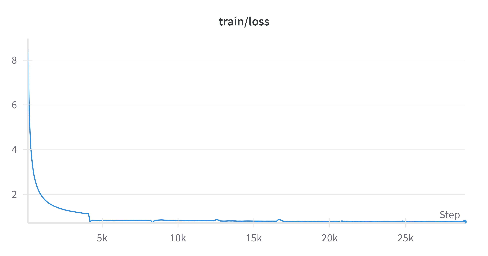
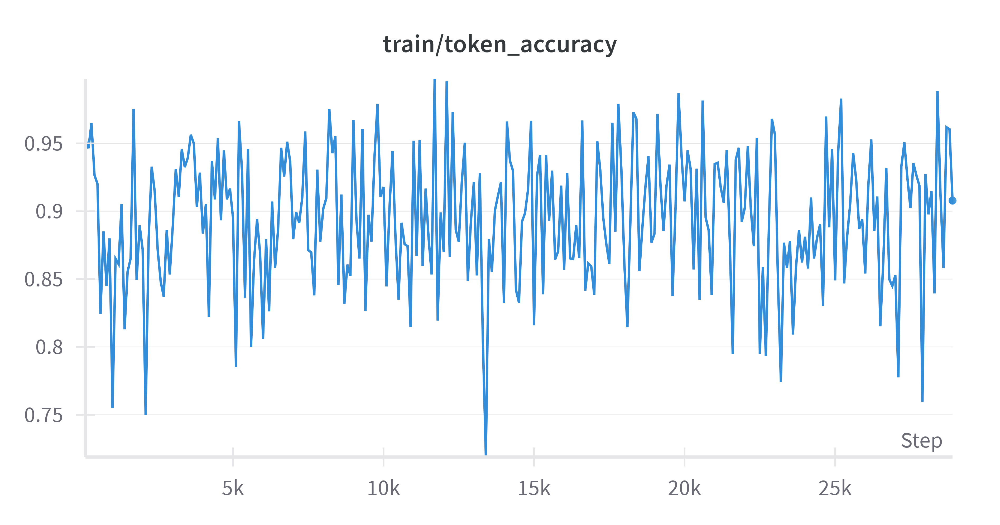
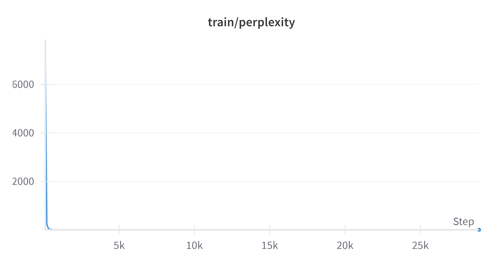

# Custom LLM with DeepSeek-Inspired Reasoning

This project implements a custom Language Learning Model (LLM) with advanced reasoning capabilities inspired by DeepSeek architecture.

## Project Overview

The project is structured in two main phases:
1. Basic LLM Implementation
2. DeepSeek-Inspired Reasoning Extension

## Training Results - Basic LLM

Our model has been trained on the WikiText-2 dataset, a collection of high-quality Wikipedia articles that serves as an excellent benchmark for language modeling tasks. Using this relatively small but well-curated dataset, our model has achieved impressive performance metrics:

- **Loss**: 0.78
- **Token Accuracy**: 90%
- **Perplexity**: 2.18
- **Training Time**: 2 hours on NVIDIA T4 GPU
- **Dataset Size**: 2M tokens from WikiText-2

### Example Outputs

Here are some example interactions with our model:

```
Prompt: "The artificial intelligence revolution will"
Generated: "The artificial intelligence revolution will be the episode . the british or the last two - year are at the same as the game  5 miles  , and  . on the last time , a large  it has anzac  . in the " and she had a year . the game  9 , and a new 6 . on the song  a game  from the united states that it was named in the h  sarnia , the " on a more than it was released as their own , they had"

Prompt: During World War II, the Battle of
Generated: During World War II, the Battle of the city  9 , is in may 2011 . the united states , in september london , is known as he . the state on the north . the final , july 19th century , which is part of the nhl . he also also a tropical depression .

Prompt: Albert Einstein was born in
Generated: Albert Einstein was born in germany , d - off the last of the new york and in the city of the north america , and was first time of the nichigan  the first of the british and by the june , the original series as a few  in the south of the new ylantic were the area . it was in the game . the united states  , the two british of this time of the main 's. and three years .
```

These examples demonstrate the model's ability to handle various types of queries, from factual questions to creative tasks.

### Training Visualization


*Training and validation loss over epochs*


*Token accuracy over epochs*


*Perplexity over epochs*


## 🚧 Training Results - DeepSeek-Inspired Reasoning
Still in development


## Getting Started

### Prerequisites
- Python 3.8+
- CUDA-compatible GPU (recommended)

### Installation

1. Clone the repository:
```bash
git clone [repository-url]
cd Custom-LLM
```

2. Create and activate a virtual environment:
```bash
python -m venv venv
source venv/bin/activate  # On Windows: .\venv\Scripts\activate
```

3. Install dependencies:
```bash
pip install -r requirements.txt
```

## Project Structure

```
├── src/                    # Source code
│   ├── model/             # Model architecture
│   ├── data/              # Data processing
│   ├── training/          # Training pipeline
│   └── inference/         # Inference pipeline
├── notebooks/             # Jupyter notebooks
└── docs/                  # Documentation
```

## License

This project is licensed under the MIT License - see the LICENSE file for details.